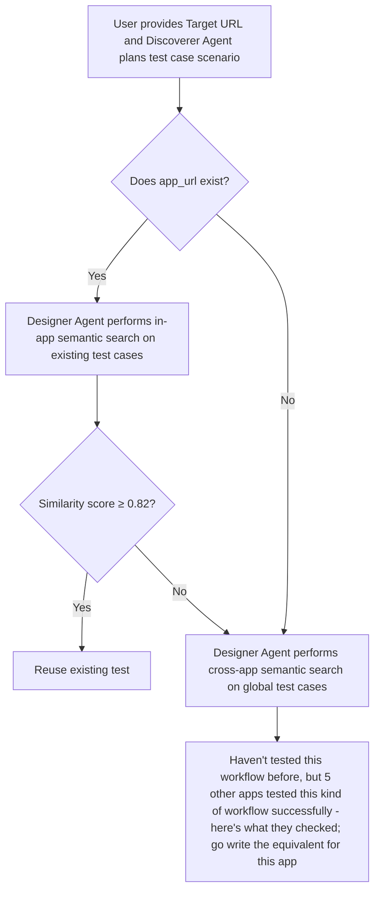

```mermaid
flowchart TD
    A[User provides Target URL and Discoverer Agent plans test case scenario]

    A --> B{Does app_url exist?}

    B -->|Yes| C[Designer Agent performs in-app semantic search on existing test cases]

    C --> D{Similarity score ≥ 0.82?}

    D -->|Yes| E[Reuse existing test]

    D -->|No| F[Designer Agent performs cross-app semantic search on global test cases]

    B -->|No| F

    F --> G[Haven't tested this workflow before, but 5 other apps tested this kind of workflow successfully - here's what they checked; go write the equivalent for this app]
```
