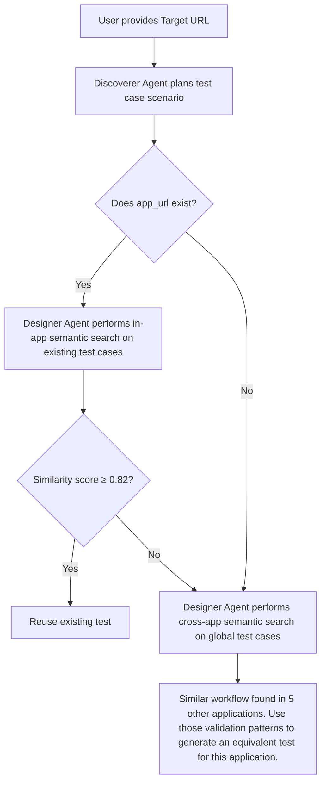

```mermaid
flowchart TD
    A[User provides Target URL]
    B[Discoverer Agent plans test case scenario]

    A --> B
    B --> C{Does app_url exist?}

    C -->|Yes| D[Designer Agent performs in-app semantic search on existing test cases]

    D --> E{Similarity score ≥ 0.82?}

    E -->|Yes| F[Reuse existing test]

    E -->|No| G[Designer Agent performs cross-app semantic search on global test cases]

    C -->|No| G

    G --> H["Similar workflow found in 5 other applications. Use those validation patterns to generate an equivalent test for this application."]
```
